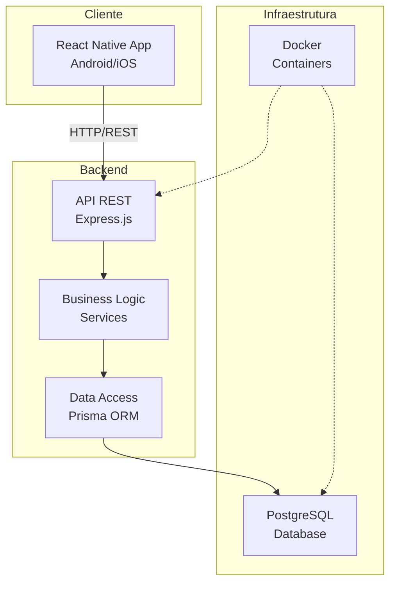
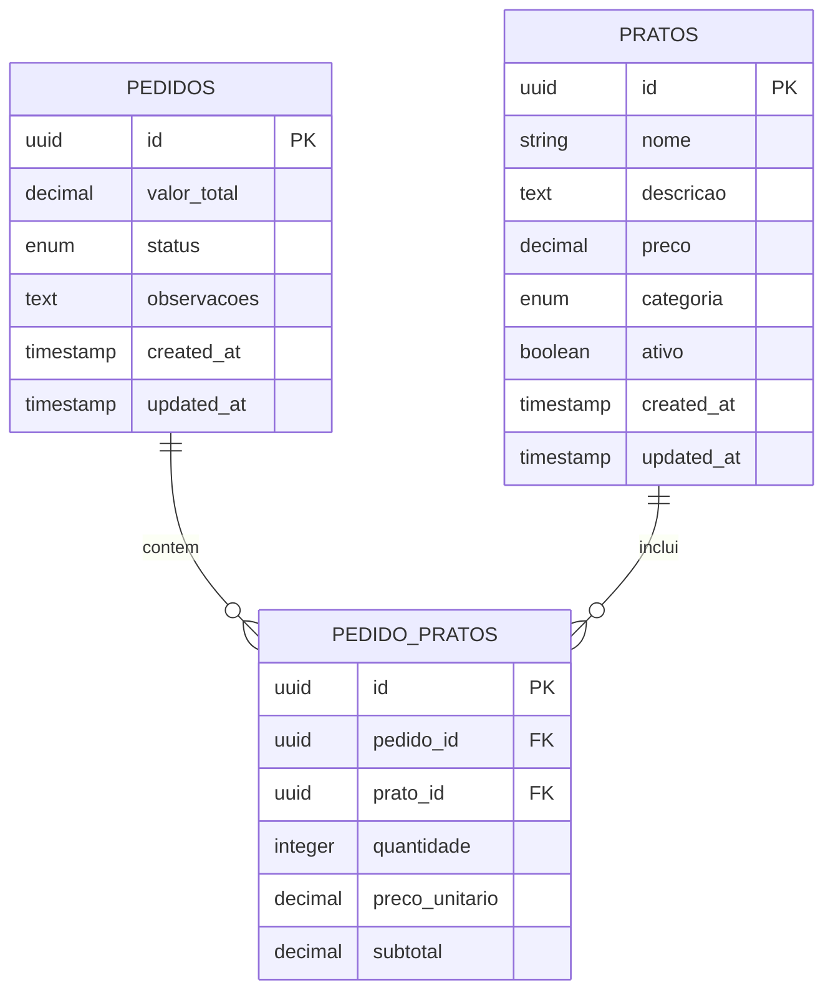

# Sistema de Gerenciamento de Pedidos de Restaurante

## 📋 Visão Geral

Sistema completo para gerenciamento de pedidos de restaurante, desenvolvido com **Node.js + Express** no backend, **React Native + Expo** no frontend, e **PostgreSQL** como banco de dados. O projeto inclui API REST bem estruturada, aplicativo mobile responsivo e infraestrutura containerizada com Docker.

## 🎯 Funcionalidades Principais

### 📱 Aplicativo Mobile (React Native + Expo)
- **Cardápio Digital**: Visualização de pratos por categoria (bebidas, pratos principais, sobremesas)
- **Criação de Pedidos**: Interface intuitiva para montar pedidos com múltiplos pratos
- **Carrinho de Compras**: Gerenciamento de itens antes da finalização
- **Acompanhamento**: Visualização do status dos pedidos em tempo real
- **Interface Responsiva**: Compatível com Android e iOS, adaptável a diferentes tamanhos de tela

### 🔧 API Backend (Node.js + Express)
- **CRUD de Pratos**: Gerenciamento completo do cardápio
- **Sistema de Pedidos**: Criação, atualização e acompanhamento de pedidos
- **Cálculo Automático**: Valor total calculado automaticamente
- **Controle de Status**: Fluxo RECEIVED → PREPARING → READY → DELIVERED
- **Documentação Completa**: README detalhado e documentação técnica
- **Validação de Dados**: Validação robusta com middlewares customizados

### 🗄️ Banco de Dados (PostgreSQL)
- **Modelagem Relacional**: Tabelas pratos, pedidos, pedido_pratos
- **Migrations**: Controle de versão do banco de dados
- **Índices Otimizados**: Performance otimizada para consultas frequentes
- **Triggers**: Cálculos automáticos e auditoria

## 🏗️ Arquitetura do Sistema



## 🚀 Início Rápido

### Pré-requisitos

- **Node.js** 18+ 
- **Docker** e **Docker Compose**
- **Git**
- **Expo CLI** (para desenvolvimento mobile)

### 1. Clone o Repositório

```bash
git clone https://github.com/Samega18/MesaFacil.git
cd MesaFacil
```

### 2. Configuração com Docker (Recomendado)

```bash
# Copiar arquivo de ambiente
cp .env.example .env

# Iniciar todos os serviços
docker-compose up -d

# Executar migrations
docker-compose exec api npm run db:migrate

# Popular banco com dados iniciais
docker-compose exec api npm run db:seed
```

### 3. Configuração Manual (Desenvolvimento)

#### Backend

```bash
cd backend

# Instalar dependências
npm install

# Configurar variáveis de ambiente
cp .env.example .env
# Editar .env com suas configurações

# Executar migrations
npm run db:migrate

# Popular banco com dados iniciais
npm run db:seed

# Iniciar servidor de desenvolvimento
npm run dev
```

#### Mobile

```bash
cd mobile

# Instalar dependências
npm install

# Iniciar Expo
npm start

# Para executar no dispositivo:
# - Instale o app Expo Go
# - Escaneie o QR code
```

### 4. Verificar Instalação

- **API**: http://localhost:3000
- **Mobile**: Expo DevTools no terminal
- **Banco**: localhost:5432

## 📁 Estrutura do Projeto

```
MesaFacil/
├── backend/                 # API REST Node.js
│   ├── src/
│   │   ├── controllers/     # Controladores da API
│   │   ├── middlewares/     # Middlewares e validações
│   │   ├── modules/         # Módulos organizados por domínio
│   │   │   ├── dishes/      # Módulo de pratos
│   │   │   └── orders/      # Módulo de pedidos
│   │   ├── routes/          # Definição das rotas
│   │   ├── services/        # Lógica de negócio
│   │   └── utils/           # Utilitários
│   ├── prisma/              # Schema e migrações do banco
│   ├── __tests__/           # Testes unitários
│   └── package.json
├── mobile/                  # App React Native
│   ├── src/
│   │   ├── components/      # Componentes reutilizáveis
│   │   ├── hooks/           # Custom hooks
│   │   ├── navigation/      # Navegação do app
│   │   ├── screens/         # Telas do aplicativo
│   │   ├── services/        # Serviços de API
│   │   ├── stores/          # Gerenciamento de estado (Zustand)
│   │   ├── types/           # Definições de tipos TypeScript
│   │   └── utils/           # Utilitários
│   ├── assets/              # Imagens e recursos
│   ├── __tests__/           # Testes unitários
│   └── package.json
├── docs/                    # Documentação do projeto
└── docker-compose.yml       # Configuração Docker
```

## 🚀 Scripts Disponíveis

### Backend
```bash
# Desenvolvimento
npm run dev          # Inicia servidor em modo desenvolvimento
npm run start        # Inicia servidor em produção

# Banco de dados
npm run seed         # Popula banco com dados de exemplo

# Testes
npm test             # Executa testes unitários
npm run test:watch   # Executa testes em modo watch
npm run test:coverage # Executa testes com cobertura
```

### Mobile
```bash
# Desenvolvimento
npm start            # Inicia o Expo
npm run android      # Executa no Android
npm run ios          # Executa no iOS
npm run web          # Executa no navegador

# Testes
npm test             # Executa testes unitários
npm run test:watch   # Executa testes em modo watch
```

### Docker

```bash
docker-compose up -d              # Iniciar todos os serviços
docker-compose down               # Parar todos os serviços
docker-compose logs api           # Ver logs da API
docker-compose exec api bash      # Acessar container da API
docker-compose exec postgres psql # Acessar banco de dados
```

## 📊 Banco de Dados

### Modelo de Dados



### Status dos Pedidos

1. **RECEIVED**: Pedido recebido, aguardando preparo
2. **PREPARING**: Pedido em preparação na cozinha
3. **READY**: Pedido pronto para entrega
4. **DELIVERED**: Pedido entregue ao cliente

## 🔌 API Endpoints

### Dishes (Pratos)

```http
GET    /api/dishes              # Listar pratos
POST   /api/dishes              # Criar prato
GET    /api/dishes/:id          # Buscar prato por ID
PUT    /api/dishes/:id          # Atualizar prato
DELETE /api/dishes/:id          # Excluir prato
```

### Orders (Pedidos)

```http
GET    /api/orders              # Listar pedidos
POST   /api/orders              # Criar pedido
GET    /api/orders/:id          # Buscar pedido por ID
PUT    /api/orders/:id          # Atualizar pedido
PATCH  /api/orders/:id/status   # Atualizar status
DELETE /api/orders/:id          # Excluir pedido
```

### Documentação Completa

- **API REST**: Endpoints bem documentados e organizados
- **README Técnico**: Documentação detalhada do projeto

## 📱 Telas do Aplicativo

### 1. Cardápio
- Lista de pratos por categoria
- Filtros por categoria e disponibilidade
- Adição rápida ao carrinho

### 2. Carrinho
- Visualização de itens selecionados
- Ajuste de quantidades
- Cálculo do valor total

### 3. Criar Pedido
- Finalização do pedido
- Confirmação e envio

### 4. Lista de Pedidos
- Visualização de todos os pedidos
- Filtros por status
- Atualização em tempo real

### 5. Detalhes do Pedido
- Informações completas do pedido
- Itens incluídos

## 🧪 Testes

### Backend

```bash
# Executar todos os testes
npm run test

# Testes com cobertura
npm run test:coverage

```

### Mobile

```bash
# Executar testes de componentes
npm run test

```

### Tipos de Teste

- **Unitários**: Testam funções e componentes isoladamente
- **Integração**: Testam interação entre módulos
- **E2E**: Testam fluxos completos da aplicação

## 📈 Performance

### Otimizações Implementadas

- **Índices de Banco**: Consultas otimizadas
- **Connection Pool**: Gerenciamento eficiente de conexões
- **Compressão**: Middleware de compressão HTTP
- **Lazy Loading**: Carregamento sob demanda no mobile
- **Memoização**: Cache de componentes React

## 🤝 Contribuição

### Workflow de Desenvolvimento

1. **Fork** o repositório
2. **Clone** seu fork localmente
3. **Crie** uma branch para sua feature (`git checkout -b feature/nova-funcionalidade`)
4. **Commit** suas mudanças (`git commit -m 'Adiciona nova funcionalidade'`)
5. **Push** para a branch (`git push origin feature/nova-funcionalidade`)
6. **Abra** um Pull Request

### Padrões de Código

- **ESLint + Prettier**: Formatação automática
- **Conventional Commits**: Padrão de mensagens de commit
- **TypeScript**: Tipagem estática
- **Testes**: Cobertura mínima de 80%

## 🛠️ Tecnologias Utilizadas

### Backend
- **Node.js** - Runtime JavaScript
- **Express.js** - Framework web
- **TypeScript** - Tipagem estática
- **Prisma** - ORM e migrations
- **PostgreSQL** - Banco de dados
- **Middlewares** - Validação e tratamento de erros
- **Winston** - Logging
- **Jest** - Testes automatizados

### Frontend
- **React Native** - Framework mobile
- **Expo** - Plataforma de desenvolvimento
- **TypeScript** - Tipagem estática
- **React Navigation** - Navegação
- **Context API** - Gerenciamento de estado
- **AsyncStorage** - Armazenamento local
- **Axios** - Cliente HTTP

### Infraestrutura
- **Docker** - Containerização
- **Docker Compose** - Orquestração
- **GitHub Actions** - CI/CD
- **ESLint + Prettier** - Qualidade de código

**Última atualização**: Outubro 2025

---

**Desenvolvido com ❤️ para o MesaFácil**